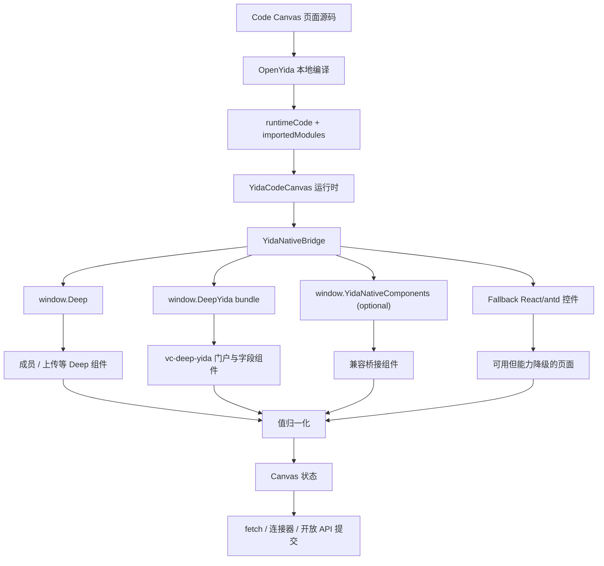

# CodeCanvas 融合门户与宜搭组件方案

## 背景

OpenYida 当前已经支持发布宜搭 Code Canvas 自定义页面：页面源码写成 `.canvas.jsx`，本地编译为 `runtimeCode` 和 `importedModules`，再保存为 `YidaCodeCanvas` 组件 Schema。Code Canvas 的好处是可以使用 React 18、hooks 和页面级崩溃隔离，适合做门户首页、工作台、看板和复杂交互页。

本方案只讨论 Code Canvas 下的自定义页面，不讨论普通自定义页面 JSX/Jsx 组件链路中的 `renderJsx` / `this.utils.yida`。

目标是在 Code Canvas 页面中融合：

- 门户组件：如 `PortalTopBanner`、`PortalQuickEntry`、`QuickAccessCard`、`RecentlyUsedCard`、`DataCard`。
- 宜搭字段/业务组件：成员、部门、附件上传、图片上传。
- Canvas 自身的 React 编排能力：布局、状态、fallback、提交与数据桥。

## 结论

当前推荐按“运行时组件桥”接入宜搭运行态组件。以下普通 npm import 写法应替换为桥接探测：

```jsx
import { EmployeeField } from '@ali/deep';
import PortalContainer from '@ali/vc-deep-yida/portalComponents';
```

原因是 Code Canvas 运行时只按依赖白名单加载 `importedModules`，当前白名单没有 `@ali/deep`、`@ali/vc-deep-yida` 或 `@ali/vc-deep-yida/portalComponents`。这类组件更适合作为宿主 `window` 上的运行态能力接入，页面可同时准备 fallback，避免组件缺失影响主流程。

推荐采用“运行时组件桥”：

1. Canvas 源码通过桥接函数读取宜搭运行态组件。
2. 在运行时从 `window.Deep`、`window.DeepYida` 探测组件；如果环境中已经存在 `window.YidaNativeComponents`，则作为兼容入口读取。
3. 找到原生组件则使用；找不到则降级为 antd 或自绘控件。
4. 所有组件输出值先归一化，再进入业务状态和提交逻辑。

一句话：**Canvas 负责页面编排，门户/宜搭组件作为可选宿主能力接入，必须有 fallback 和值适配。**

## 当前证据

### Code Canvas 运行方式

`vc-deep-yida/src/components/yida-code-canvas/factory.tsx` 中，`YidaCodeCanvas` 会：

- 读取 `runtimeCode` 和 `importedModules`。
- 按 `dependencies.ts` 白名单加载依赖。
- 用 `new Function` 在真实 `window` 中执行代码。
- 渲染返回的 `YidaComp`。

这说明 Canvas 代码可以访问宿主 `window`；白名单外的宜搭组件通过宿主桥接使用，通用前端库通过依赖白名单 import。

### 依赖白名单边界

`vc-deep-yida/src/components/yida-code-canvas/dependencies.ts` 和 OpenYida 的 `lib/app/canvas-compile.js` 当前只包含 React、ReactDOM、antd、ahooks、d3、recharts、Radix、lucide-react、framer-motion 等依赖。

白名单外的宜搭运行态包走宿主桥接或依赖白名单扩展：

- `@ali/deep`
- `@ali/deep-table`
- `@ali/vc-deep-yida`
- `@ali/vc-deep-yida/portalComponents`
- `@ali/yida-ui`
- `@ali/yc-utils`

### `vc-deep-yida` 中的组件形态

`vc-deep-yida` 运行包中已经包含以下组件：

- 门户：`PortalTopBanner`、`PortalQuickEntry`、`PortalContainer`、`QuickAccessCard`、`RecentlyUsedCard`、`DataCard`。
- 字段：`EmployeeField`、`DepartmentSelectField`、`AttachmentField`、`ImageField`。

其中：

- `EmployeeField` 是对 `@ali/deep.EmployeeField` 的包装，并默认开启 `supportDepartment`。
- `DepartmentSelectField` 是 `vc-deep-yida` 自己的部门选择组件，内部依赖 `@ali/deep.SelectField`、`EmployeeSearch`、`@ali/yc-utils` 和部门接口。
- `AttachmentField` / `ImageField` 依赖上传、OSS 签名、文件预览、插件扩展点和页面配置。
- 门户组件里，`PortalTopBanner` 和 `PortalQuickEntry` 更偏展示，`QuickAccessCard`、`RecentlyUsedCard`、`DataCard` 更依赖门户/应用/数据卡片上下文。

## 设计原则

### 宿主能力按环境探测

运行态存在 `window.Deep` 或 `window.DeepYida`，需要结合设计态、运行态、移动端、内外网、灰度版本差异做探测。

因此代码必须：

- feature detect。
- graceful fallback。
- 在页面内暴露诊断信息。
- 组件条件未满足时，页面主流程仍由 fallback 承接。

### 值结构由 OpenYida 统一

成员、部门、上传组件的原生返回值可能随版本变化。页面业务逻辑不直接消费原始值，而是消费 OpenYida 归一化后的结构。

### 原生组件负责交互输入，数据桥由页面承担

Code Canvas 没有普通自定义页的 `this.dataSourceMap`、`this.$(fieldId)` 或 `this.utils.yida.*`。页面的数据读写仍然要通过：

- fetch 调宜搭开放 API。
- 已配置连接器代理。
- 后端服务接口。
- 页面 props 中未来显式注入的数据桥。

原生组件负责选择和上传交互；表单实例创建、更新、流程提交等动作由页面 fetch、连接器或后端接口完成。

## 总体架构



## 分层方案

### L0：当前即可落地

不改 `vc-deep-yida` 和 Code Canvas 物料，仅在 Canvas 页面里写桥接工具：

- `findYidaComponent(name)`：从多个全局位置查找组件。
- `normalizeEmployeeValue(value)`：归一化成员值。
- `normalizeDepartmentValue(value)`：归一化部门值。
- `normalizeFileValue(value)`：归一化附件/图片值。
- `FallbackMemberPicker`、`FallbackDepartmentPicker`、`FallbackUploader`：兜底控件。

适合做烟测页和第一版交付。

### L1：OpenYida 产品化

在 OpenYida 中新增 Code Canvas 示例：

- `lib/samples/yida-canvas-custom-page/native-components-smoke.canvas.jsx`
- `lib/samples/yida-canvas-custom-page/portal-native-components.canvas.jsx`

`native-components-smoke` 只做运行态验证：

- 清点 `window.Deep`、`window.DeepYida`、可选 `window.YidaNativeComponents` 上的组件。
- 对目标组件做单独试渲染，失败时隔离错误，不影响整页。
- 捕获成员、部门、上传等组件的真实 `onChange` / click payload，供业务页归一化适配。

`portal-native-components` 内置：

- 门户 Banner。
- 快捷入口。
- 成员选择。
- 部门选择。
- 附件/图片上传。
- 运行时诊断面板。
- fallback 控件。

同时把相关说明补到 `yida-canvas-custom-page` 技能文档中，形成“通过宿主桥受控接入原生组件，并提供 fallback 与 smoke 验证”的正向指引。

### L2：维护推荐矩阵

不改 `vc-deep-yida` 时，不引入新的全局桥约定。OpenYida 通过 smoke 结果维护推荐矩阵：

- `preferred`：多个运行态验证稳定，可在业务页优先增强。
- `verify`：需要按应用、端和权限验证后启用。
- `fallback-first`：默认使用 Canvas 自绘，原生组件只作为增强。

推荐矩阵写入 skill/reference，后续 AI 生成页面按矩阵选择组件。

### L3：沉淀 OpenYida runtime adapter

保持当前“源码内桥接函数 + sample 模板”的形态，不新增编译器虚拟模块。后续如果多个样例重复度升高，可以在 OpenYida 文档与模板中沉淀一份 adapter 片段：

```js
findYidaComponent(name)
normalizeEmployeeValue(value)
normalizeDepartmentValue(value)
normalizeFileValue(value)
```

这样仍然不要求 `vc-deep-yida` 改造，也不会把宜搭运行态包写入 `importedModules`。

## 运行时桥设计

### 组件查找

```jsx
function findYidaComponent(name) {
  const deep = window.Deep || {};
  if (deep[name]) return deep[name];

  const deepYida = window.DeepYida;
  const candidates = [
    deepYida && deepYida.default,
    deepYida && deepYida.components,
    deepYida,
  ];

  for (const candidate of candidates) {
    if (!candidate) continue;
    if (candidate[name]) return candidate[name];
    if (Array.isArray(candidate)) {
      const found = candidate.find((item) => item && (item.displayName === name || item.name === name));
      if (found) return found;
    }
  }

  const native = window.YidaNativeComponents || {};
  if (native[name]) return native[name];

  return null;
}
```

### 组件注册表

```jsx
const YidaNative = {
  PortalTopBanner: findYidaComponent('PortalTopBanner'),
  PortalQuickEntry: findYidaComponent('PortalQuickEntry'),
  PortalContainer: findYidaComponent('PortalContainer'),
  QuickAccessCard: findYidaComponent('QuickAccessCard'),
  RecentlyUsedCard: findYidaComponent('RecentlyUsedCard'),
  DataCard: findYidaComponent('DataCard'),
  EmployeeField: findYidaComponent('EmployeeField'),
  DepartmentSelectField: findYidaComponent('DepartmentSelectField'),
  AttachmentField: findYidaComponent('AttachmentField'),
  ImageField: findYidaComponent('ImageField'),
};
```

### 诊断信息

页面应在开发/测试模式显示诊断信息：

```jsx
function getNativeDiagnostics() {
  const deep = window.Deep || {};
  const deepYida = window.DeepYida;
  const deepYidaBundle = deepYida && (deepYida.default || deepYida.components || deepYida);

  return {
    hasDeep: !!window.Deep,
    hasDeepYida: !!window.DeepYida,
    deepKeys: Object.keys(deep).slice(0, 80),
    deepYidaDisplayNames: Array.isArray(deepYidaBundle)
      ? deepYidaBundle.map((item) => item && item.displayName).filter(Boolean)
      : [],
    available: Object.keys(YidaNative).filter((key) => !!YidaNative[key]),
    missing: Object.keys(YidaNative).filter((key) => !YidaNative[key]),
  };
}
```

## 组件分级

| 组件 | 当前建议 | 原因 |
| --- | --- | --- |
| `PortalTopBanner` | 优先试用 | 展示型组件，props 较简单，fallback 容易 |
| `PortalQuickEntry` | 优先试用 | 静态入口能力强，适合门户首页 |
| `EmployeeField` | 优先试用 | `window.Deep.EmployeeField` 命中概率高；必须记录 onChange 结构 |
| `DepartmentSelectField` | 验证后启用 | 是 `vc-deep-yida` 包装组件，依赖部门接口和 `EmployeeSearch` |
| `AttachmentField` | 验证后启用 | 依赖 OSS 签名、上传权限、页面配置、预览扩展 |
| `ImageField` | 验证后启用 | 与上传类似，额外有图片预览和移动端能力 |
| `QuickAccessCard` | 验证后启用 | 会请求应用快捷入口接口，依赖组织权限 |
| `RecentlyUsedCard` | 验证后启用 | 会请求最近访问应用接口，依赖组织权限 |
| `DataCard` | 验证后增强启用 | 依赖数据卡片配置、图表上下文和门户变量 |
| `PortalContainer` | 暂缓默认启用 | 容器型组件，依赖 `_grid`、titleConfig、数据配置和门户上下文 |

## 值归一化

### 成员

目标结构：

```js
{
  userId: '',
  emplId: '',
  name: '',
  nickName: '',
  workNo: '',
  avatar: '',
  raw: {}
}
```

归一化示例：

```jsx
function normalizeEmployeeValue(input) {
  const list = Array.isArray(input) ? input : input ? [input] : [];
  return list.map((item) => ({
    userId: item.userId || item.userid || item.value || item.emplId || '',
    emplId: item.emplId || item.value || item.userId || '',
    name: item.name || item.label || item.text || item.nickName || '',
    nickName: item.nickName || '',
    workNo: item.workNo || '',
    avatar: item.avatar || item.avatarUrl || '',
    raw: item,
  }));
}
```

### 部门

目标结构：

```js
{
  deptId: '',
  value: '',
  name: '',
  text: '',
  deptFullPath: '',
  raw: {}
}
```

归一化示例：

```jsx
function normalizeDepartmentValue(input) {
  const list = Array.isArray(input) ? input : input ? [input] : [];
  return list.map((item) => ({
    deptId: item.deptId || item.value || item.id || '',
    value: item.value || item.deptId || item.id || '',
    name: item.name || item.text || item.label || '',
    text: item.text || item.name || item.label || '',
    deptFullPath: item.deptFullPath || '',
    raw: item,
  }));
}
```

### 文件

目标结构：

```js
{
  name: '',
  url: '',
  downloadURL: '',
  imgURL: '',
  fileId: '',
  size: 0,
  type: '',
  raw: {}
}
```

归一化示例：

```jsx
function normalizeFileValue(input) {
  const list = Array.isArray(input) ? input : input ? [input] : [];
  return list.map((item) => {
    const response = item.response || {};
    const content = response.content || response || {};
    return {
      name: item.name || content.name || content.fileName || '',
      url: item.url || content.url || content.previewUrl || '',
      downloadURL: item.downloadURL || content.downloadURL || content.downloadUrl || '',
      imgURL: item.imgURL || content.imgURL || content.previewUrl || '',
      fileId: item.fileId || content.fileId || content.sequence || '',
      size: item.size || content.size || 0,
      type: item.type || content.type || '',
      raw: item,
    };
  });
}
```

## 页面代码骨架

```jsx
import React, { useMemo, useState } from 'react';

function YidaComp() {
  const [members, setMembers] = useState([]);
  const [departments, setDepartments] = useState([]);
  const [files, setFiles] = useState([]);

  const native = useMemo(() => ({
    PortalTopBanner: findYidaComponent('PortalTopBanner'),
    PortalQuickEntry: findYidaComponent('PortalQuickEntry'),
    EmployeeField: findYidaComponent('EmployeeField'),
    DepartmentSelectField: findYidaComponent('DepartmentSelectField'),
    AttachmentField: findYidaComponent('AttachmentField'),
    ImageField: findYidaComponent('ImageField'),
  }), []);

  const PortalTopBanner = native.PortalTopBanner;
  const PortalQuickEntry = native.PortalQuickEntry;
  const EmployeeField = native.EmployeeField;
  const DepartmentSelectField = native.DepartmentSelectField;
  const UploadField = native.AttachmentField || native.ImageField;

  return (
    <div className="oy-portal-page">
      {PortalTopBanner ? (
        <PortalTopBanner
          mainTitle="统一业务门户"
          subTitle="入口、协作、材料提交与动态概览"
          bannerHeight="160px"
          textPosition="left"
        />
      ) : (
        <FallbackPortalBanner />
      )}

      {PortalQuickEntry ? (
        <PortalQuickEntry
          titleConfig={{ showTitle: true, title: '快捷入口' }}
          content={[
            {
              icon: { type: 'icon', value: 'yingyong', name: '应用' },
              linkType: 'url',
              title: '事项发起',
              url: '#',
              desc: '',
              group: '常用',
            },
          ]}
          themeConfig={{
            layout: 'top-bottom',
            backgroundColorMode: 'default',
            iconBackgroundColorMode: 'dark',
          }}
        />
      ) : (
        <FallbackQuickEntry />
      )}

      <section className="oy-native-form">
        {EmployeeField ? (
          <EmployeeField
            label="负责人"
            multiple
            value={members}
            onChange={(next) => setMembers(normalizeEmployeeValue(next && next.value ? next.value : next))}
          />
        ) : (
          <FallbackMemberPicker value={members} onChange={setMembers} />
        )}

        {DepartmentSelectField ? (
          <DepartmentSelectField
            label="协作部门"
            multiple
            value={departments}
            onChange={(next) => setDepartments(normalizeDepartmentValue(next && next.value ? next.value : next))}
          />
        ) : (
          <FallbackDepartmentPicker value={departments} onChange={setDepartments} />
        )}

        {UploadField ? (
          <UploadField
            label="材料附件"
            multiple
            value={files}
            onChange={(next) => setFiles(normalizeFileValue(next && next.value ? next.value : next))}
            onSuccess={(res) => setFiles((prev) => normalizeFileValue(prev.concat(res)))}
          />
        ) : (
          <FallbackUploader value={files} onChange={setFiles} />
        )}
      </section>
    </div>
  );
}

export default YidaComp;
```

## Fallback 策略

### 成员 fallback

短期可以提供文本/标签录入，或用业务接口搜索成员：

- 输入姓名或工号。
- 选择后保存 `{ name, workNo, userId }`。
- 不伪造原生 `EmployeeField` 的完整返回值。

### 部门 fallback

短期可以提供部门名称录入或远程搜索：

- 输入部门名称。
- 选择后保存 `{ name, deptId }`。
- 没有通讯录权限时展示权限提示。

### 上传 fallback

当原生上传组件条件未满足时，有两种降级：

1. 只允许粘贴 URL，保存为附件链接。
2. 通过 OpenYida 已配置的连接器或后端上传接口上传，不直接调用内部 OSS 签名接口。

Cookie、CSRF 或 OSS 密钥由平台、连接器或后端服务管理，Canvas 只消费安全返回结果。

## 数据提交

Canvas 页面没有 `this.dataSourceMap`，提交应走显式 HTTP：

```jsx
async function submitPortalForm(payload) {
  const response = await fetch('/v1/form/saveFormData.json', {
    method: 'POST',
    credentials: 'include',
    headers: {
      'Content-Type': 'application/json',
    },
    body: JSON.stringify(payload),
  });

  const result = await response.json();
  if (!response.ok || result.success === false) {
    throw new Error(result.errorMsg || '提交失败');
  }
  return result;
}
```

实际接口应按目标表单、连接器或后端服务决定。页面只提交归一化后的数据，不提交原生组件 raw 对象作为主数据。

## 验证方案

### Smoke 页面

新增一个只做探测的 Canvas 页面，发布后检查：

- `window.Deep` 是否存在。
- `window.Deep.EmployeeField` 是否存在。
- `window.Deep.AttachmentField` / `window.Deep.ImageField` 是否存在。
- `window.DeepYida` 是否存在。
- `window.DeepYida` bundle 里是否能找到 `PortalTopBanner`、`PortalQuickEntry`、`DepartmentSelectField`。
- PC 和移动端是否一致。

### 组件验收

| 能力 | 验收点 |
| --- | --- |
| 门户 Banner | 能渲染、样式正常、fallback 可用 |
| 快捷入口 | 静态入口能渲染、点击行为可控 |
| 成员 | 弹层/搜索/选择/清空正常，记录真实 `onChange` 结构 |
| 部门 | 部门搜索、通讯录权限提示、单选/多选正常 |
| 附件上传 | 文件选择、上传成功、删除、预览、失败提示正常 |
| 图片上传 | 图片选择、上传成功、预览、大小/类型限制正常 |
| 提交 | 归一化 payload 正确，接口失败可恢复 |
| 降级 | 任一原生组件缺失时页面不白屏 |

### 运行态覆盖

- 设计态预览。
- 正式运行态。
- PC。
- 移动端。
- 内网/公网域名。
- 有通讯录权限/无通讯录权限。
- 上传权限正常/上传权限受限。

## 风险与规避

| 风险 | 影响 | 规避 |
| --- | --- | --- |
| `window.DeepYida` 结构不稳定 | 找不到门户组件 | 通过 smoke 页面记录真实结构，业务页统一走 `findYidaComponent`，并保留 Canvas fallback |
| 原生组件依赖上下文 | 弹层或请求失败 | smoke 验证后启用，fallback 保底 |
| 上传依赖 OSS 和页面配置 | 上传失败 | 原生上传只作为增强能力，fallback 支持链接或连接器上传 |
| 返回值结构漂移 | 提交数据异常 | 所有值必须 normalize，raw 仅用于调试 |
| 移动端组件不同 | 移动端白屏或样式错乱 | 独立验证 mobile bundle，必要时按端降级 |
| 组件 CSS 未加载 | 组件可渲染但样式错乱 | 依赖宿主已加载组件 CSS；否则不启用原生组件 |

## OpenYida 改造建议

### P0：新增文档和示例

- 新增本文档。
- 新增 `native-components-smoke.canvas.jsx` 示例。
- 新增 `portal-native-components.canvas.jsx` 示例。
- 示例里包含运行时诊断、组件桥、fallback 和值归一化。

### P1：更新技能说明

更新 `yida-canvas-custom-page`：

- 推荐表述：“Code Canvas 通过受控运行时探测接入 `window.Deep` / `window.DeepYida`，并兼容已有 `window.YidaNativeComponents`；页面提供 fallback、值归一化和 smoke 验证。”

### P2：维护推荐矩阵

根据 `native-components-smoke` 的真实验证结果，把门户、成员、部门、上传组件维护为 `preferred` / `verify` / `fallback-first` 三档。AI 后续生成业务页时按矩阵决定默认启用还是保持 Canvas 自绘优先。

### P3：Schema 混排能力（远期）

长期可以支持 `YidaCodeCanvas` 与原生门户组件在 Schema `componentsTree` 中混排。

这条路线更强，但复杂度更高，因为需要 OpenYida 发布器理解门户组件的 Schema props、children、componentsMap 和布局规则。它不再是纯 Canvas 源码方案。

## 推荐里程碑

1. 第 1 阶段：完成 smoke 页面，确认各环境下可探测组件列表。
2. 第 2 阶段：完成 `portal-native-components.canvas.jsx` 示例，默认启用 `PortalTopBanner`、`PortalQuickEntry`、`EmployeeField`，其他组件只在探测成功时显示。
3. 第 3 阶段：把部门、附件、图片上传纳入示例，补齐归一化和提交 demo。
4. 第 4 阶段：根据 smoke 结果维护推荐矩阵，明确哪些组件可默认增强、哪些组件保持 fallback 优先。
5. 第 5 阶段：按真实项目反馈扩展 adapter 片段和样例，不进入 `vc-deep-yida` 改造链路。

## 最终建议

第一版建议采用更稳的产品表达：

> Code Canvas 支持通过 OpenYida Native Bridge 受控接入部分宜搭运行态组件。门户展示、成员选择、部门选择、附件/图片上传会按运行环境自动增强；不满足运行条件时降级为 Canvas 自绘控件，页面不会白屏，提交数据结构保持一致。

这能同时兼顾体验、稳定性和后续演进空间。
