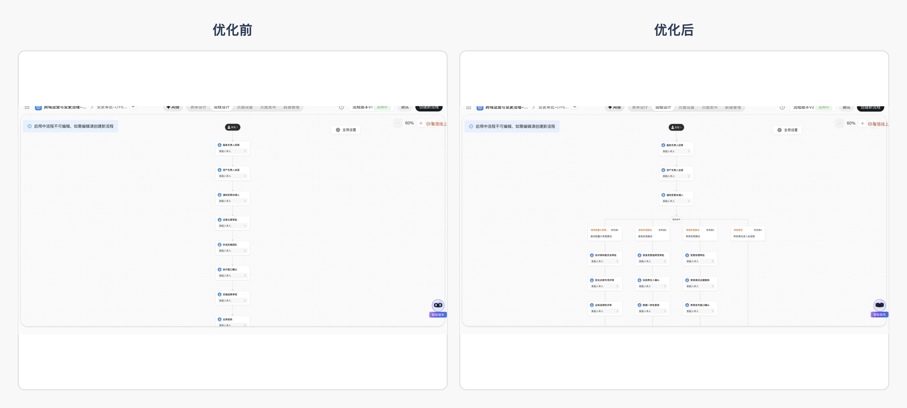
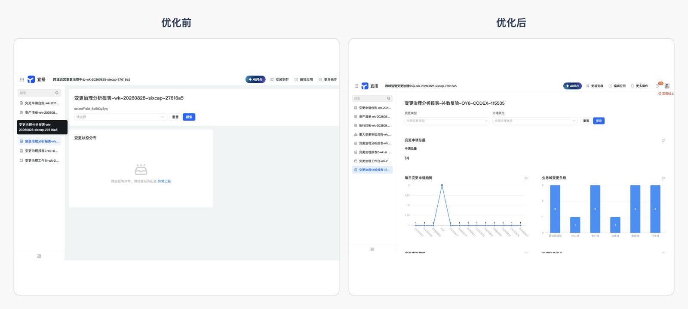

# OpenYida 本周产品体验优化汇报

**汇报日期：2026 年 8 月 28 日**

## 一、整体结论

本周围绕 OpenYida 的登录完成页、复杂审批流程、集成自动化、聚合表和原生报表进行了集中优化。过去部分页面存在“操作虽然完成，但用户看不懂”“配置像未完成”“页面空白或数据不足”等问题；优化后，关键状态更明确、业务结构更完整、数据展示更直观，已经能够支撑真实业务场景演示和阶段汇报。

> 一句话总结：OpenYida 本周把多个“成功但看不懂、配置像未完成、页面空或数据少”的体验，升级为“状态明确、数据可见、业务场景可讲”的完整产品体验。

## 二、用户反馈驱动优化

本周优化不是闭门推进，而是持续收集一线使用反馈，再把高频问题转化为明确的产品改进项。反馈主要来自实际搭建过程、用户群讨论和专项问题记录。

| 用户反馈主题 | 推动的改进方向 | 当前状态 |
|---|---|---|
| 报表日期粒度只能按天处理 | 扩展报表日期粒度，保留年、月、日、小时、分钟、秒等业务语义 | 已纳入本周优化 |
| 登录状态变化后表单更新看似成功、实际未生效 | 避免创建请求重复执行，并按目标表单最新版本保存 | 已纳入本周优化 |
| 已创建的集成自动化需要继续编辑 | 补齐整图更新、明确替换、配置回读和节点摘要展示 | 已纳入本周优化 |
| 编辑连接器或自动化参数后原配置可能丢失 | 部分编辑保留未修改配置，只有明确要求时才清空 | 已纳入本周优化 |
| 子表需要可引用的自动序号或流水号 | 评估子表序号字段、公式引用和数据新增场景 | 持续跟进 |
| 流程抄送希望选择子表中的人员字段 | 评估流程节点对动态人员字段的支持范围 | 持续跟进 |
| 原生报表和视图查询大数据时加载较慢 | 持续优化数据读取、图表配置和大数据量展示体验 | 持续跟进 |
| 希望通过 API 按名单或信息自动开通平台权限 | 结合权限安全边界评估标准化操作流程 | 持续跟进 |
| 希望 OpenYida 打通钉钉打印模板 | 梳理打印模板创建、调整和发布能力 | 持续跟进 |

> 说明：钉钉汇报文档中附有三张用户反馈原始截图；本地仓库版本不保存包含内部姓名和头像的原图。
## 三、本周优化总览

| 场景 | 一句话问题描述 | 原来现象 | 优化后现象 | 业务价值 |
|---|---|---|---|---|
| 登录完成页 | 登录完成后的反馈过于简陋 | 英文纯文本铺在空白页面中，缺少品牌、完成状态和后续提示 | 使用中文品牌化成功卡片，明确身份验证完成，并提示窗口将自动关闭 | 用户能一眼确认结果，减少“是否登录成功”的疑惑 |
| 审批流程 | 复杂业务分流表达不足 | 原流程以线性串行为主，缺少明确的多分支条件 | 增加三类明确条件和默认路径，形成 25 个业务节点的完整流程 | 能覆盖重大变更、紧急变更、常规变更及兜底场景 |
| 集成自动化 | 已有配置在画布中表达不清 | 新增、更新等动作虽然已有内容，但摘要仍像“待配置” | 查询、新增、更新、消息通知等节点都能显示清晰配置摘要 | 运营人员可以直接从画布判断每一步要做什么 |
| 聚合表 | 聚合结果为空 | 设计页没有数据源和指标，运行页无法展示业务结果 | 接入两个数据源、一个关联关系和两个指标，运行页展示 3 条聚合结果 | 可直接呈现团队、目标和风险指标，支撑管理判断 |
| 原生报表 | 数据不足且出现查询异常 | 报表页提示数据查询异常，缺少可讲解的图表和明细 | 补充到 14 条业务数据，展示指标、趋势、柱状图、饼图、漏斗和明细表 | 报表从“无法展示”升级为可用于汇报的业务看板 |

## 四、登录完成页优化

登录完成页从简单英文回调文字升级为完整的中文成功界面：加入 OpenYida 品牌、成功图标、明确的完成文案以及自动关闭状态，让用户无需回到终端猜测登录结果。

| 登录完成页前后对比 |
|---|
|  |

## 五、复杂审批流程优化

流程围绕跨域运营变更场景展开，补充重大变更、紧急变更、常规变更三类明确条件和默认处理路径；各路径继续包含审批、登记、回执、证据标记和结果通知等业务环节，节点总数达到 25 个。

| 审批流程前后对比 |
|---|
|  |

## 六、集成自动化优化

集成自动化覆盖表单触发、业务数据查询、分支判断、新增回执、更新证据以及消息通知等环节。优化重点是让每个节点都能在画布上准确表达已经配置的内容，避免“明明配置过，画布仍显示待设置”的误解。

| 集成自动化前后对比 |
|---|
|  |

## 七、聚合表优化

聚合表从空白设计页升级为可直接查看结果的运行页面。当前场景以团队维度汇总目标达成和资产风险，展示 3 条聚合结果，能够直观看到责任团队、目标指标和风险值。

| 聚合表前后对比 |
|---|
|  |

## 八、原生报表优化

报表补充了 14 条业务数据，覆盖多类变更类型和业务域。页面现在可以同时展示申请总量、每日趋势、业务域负载、状态分布、处理漏斗和详细记录，既能看总体，也能下钻到具体业务明细。

| 原生报表前后对比 |
|---|
|  |

### 报表完整内容补充

## 九、优化明细清单

以下清单把本周改动进一步拆成可以逐项汇报的产品优化点。

### 1. 登录完成页

| 序号 | 优化点 | 用户可感知的变化 |
|---|---|---|
| 01 | 登录成功页中文化 | 从英文技术提示改为清晰的中文完成文案 |
| 02 | 增加 OpenYida 品牌展示 | 页面不再是无品牌的空白回调页 |
| 03 | 增加成功图标和卡片布局 | 登录结果更加醒目，视觉层级更清楚 |
| 04 | 增加自动关闭状态提示 | 用户知道页面会自动返回，无需手动判断下一步 |

### 2. 表单与数据

| 序号 | 优化点 | 用户可感知的变化 |
|---|---|---|
| 05 | 表单字段保存按实际结构处理 | 减少字段已创建但页面结构不一致的情况 |
| 06 | 表单样式与字段配置使用同一有效版本 | 降低保存时出现版本冲突的概率 |
| 07 | 应用导入时读取目标表单最新版本 | 导入旧应用时不再沿用来源应用的过期版本号 |
| 08 | 创建表单时避免重复提交 | 登录状态变化时不会意外创建两个同名表单 |
| 09 | 创建页面时避免重复提交 | 页面创建结果不确定时不会自动再次创建 |
| 10 | 数据新增参数按字段结构检查 | 字段名或数据格式错误会更早被识别 |

### 3. 审批流程

| 序号 | 优化点 | 用户可感知的变化 |
|---|---|---|
| 11 | 流程写入前检查节点和连线完整性 | 缺少路径或结束节点时不会生成半成品流程 |
| 12 | 检查重复节点名称 | 避免同名审批节点造成配置和阅读混乱 |
| 13 | 检查审批人配置 | 审批人缺失时会明确提示，不再等发布后才发现 |
| 14 | 整图替换需要明确确认 | 修改已有流程时更不容易误覆盖原配置 |
| 15 | 草稿选择规则更明确 | 存在多个候选草稿时不会猜测使用哪一个 |
| 16 | 区分流程设计完成与实际运行完成 | 页面可查看不再被误解为业务已经走通 |
| 17 | 增加重大变更条件路径 | 高风险事项进入更严格的审批链路 |
| 18 | 增加紧急回滚条件路径 | 紧急事项拥有独立的快速处理路线 |
| 19 | 增加常规变更和默认路径 | 未命中特殊条件的事项也有明确去向 |
| 20 | 复杂流程扩展至 25 个业务节点 | 审批、登记、回执、证据和通知形成完整闭环 |

### 4. 集成自动化

| 序号 | 优化点 | 用户可感知的变化 |
|---|---|---|
| 21 | 首次保存前检查整张自动化画布 | 不完整配置不会先写入远端形成脏数据 |
| 22 | 整图替换需要明确指令 | 编辑已有自动化时减少误覆盖风险 |
| 23 | 区分保存失败与发布失败 | 用户能知道问题发生在配置阶段还是上线阶段 |
| 24 | 节点类型按平台支持范围检查 | 不支持的节点不会被当作可发布配置 |
| 25 | 连接器节点参数按结构检查 | 字段缺失或类型不正确时会明确指出 |
| 26 | 自动化列表支持有界翻页 | 资源较多时仍能稳定找到目标，同时避免无限查询 |
| 27 | 自动化名称和标识精确匹配 | 不会因同名或模糊匹配改错目标 |
| 28 | 查询节点显示真实动作摘要 | 画布可直接看出节点是在读取单条业务数据 |
| 29 | 新增节点显示目标表单和字段数量 | 不再把已配置节点显示成“请设置新增数据” |
| 30 | 消息节点显示已配置通知内容 | 运营人员无需逐个点开判断消息是否配置 |
| 31 | 新增节点面板展示三项字段赋值 | 画布摘要与详情面板保持一致 |
| 32 | 空自动化配置禁止发布 | 避免只建名称、没有业务内容的空壳自动化 |

### 5. 自定义连接器

| 序号 | 优化点 | 用户可感知的变化 |
|---|---|---|
| 33 | 连接器列表支持有界翻页 | 连接器较多时不会只查第一页而误判不存在 |
| 34 | 操作列表和连接列表统一精确查询 | 更稳定地找到目标操作与连接账号 |
| 35 | Basic 认证凭据不写入连接器定义 | 用户名和密码只在需要时使用，不进入普通配置内容 |
| 36 | 校验连接账号归属 | 避免把其他连接器的账号误配到当前连接器 |
| 37 | 编辑部分参数时保留未修改配置 | 调整查询参数时不会清空请求头、请求体或响应映射 |
| 38 | 只有明确要求时才清空配置 | 空值不再被默认为“删除全部原配置” |
| 39 | 保留认证、请求参数和返回结构 | 多次编辑后连接器仍保持完整可用状态 |
| 40 | 无实际变化的编辑会被识别 | 避免看似保存成功、实际什么都没改 |
| 41 | 写入后重新读取关键配置 | 用户看到的保存结果与平台实际内容保持一致 |
| 42 | 共享连接器删除增加归属保护 | 无法确认归属时不会直接删除公共资源 |

### 6. 聚合表

| 序号 | 优化点 | 用户可感知的变化 |
|---|---|---|
| 43 | 保存前检查数据源 | 没有数据源的空聚合表不会被当成完整结果 |
| 44 | 保存前检查关联关系 | 多表关联缺失时能及时发现 |
| 45 | 保存前检查指标配置 | 没有计算指标时不会生成无意义视图 |
| 46 | 更新前读取聚合表最新版本 | 多次编辑时降低覆盖他人新配置的风险 |
| 47 | 保存结果不明确时停止继续操作 | 网络结果不确定时不会盲目再次覆盖 |
| 48 | 区分草稿配置与正式配置 | 用户能明确当前看到的是编辑态还是发布态 |
| 49 | 发布后读取实际计算状态 | 不再只依据“保存成功”判断聚合表可用 |
| 50 | 聚合运行页展示 3 条结果和 2 个指标 | 原来的空页面变为可直接查看的业务数据 |

### 7. 原生报表

| 序号 | 优化点 | 用户可感知的变化 |
|---|---|---|
| 51 | 图表类型统一能力清单 | 创建报表时能明确哪些图表可以使用 |
| 52 | 创建前检查字段是否存在 | 不会把不存在的字段带入图表配置 |
| 53 | 创建前检查维度和指标搭配 | 减少图表创建后没有数据的情况 |
| 54 | 自动安排组件位置与尺寸 | 多图表页面不再容易重叠或布局混乱 |
| 55 | 日期粒度支持年到秒 | 年、月、日、小时等统计方式可以按业务需要保留 |
| 56 | 报表详情读取采用统一结构 | 页面内容和平台保存内容更容易保持一致 |
| 57 | 清理仅供创建阶段使用的临时信息 | 避免临时字段干扰最终报表配置 |
| 58 | 组织诊断信息脱敏 | 报错和说明中不暴露组织相关信息 |
| 59 | 空报表配置禁止保存 | 避免只创建标题、没有任何组件的报表 |
| 60 | 报表补充至 14 条业务数据 | 趋势和分类分布不再因样本太少而失真 |
| 61 | 增加申请总量指标 | 汇报时可以快速看到整体规模 |
| 62 | 增加每日趋势图 | 可以观察一段时间内的变化走势 |
| 63 | 增加业务域柱状图 | 可以对比不同业务域的工作负载 |
| 64 | 增加类型饼图 | 可以查看各类变更的结构占比 |
| 65 | 增加状态漏斗 | 可以直观看到事项在各处理阶段的分布 |
| 66 | 增加详细记录表 | 管理者可以从总体图表继续查看具体明细 |

### 8. 权限与敏感信息

| 序号 | 优化点 | 用户可感知的变化 |
|---|---|---|
| 67 | 权限包按唯一名称和标识定位 | 避免同名权限包被误选 |
| 68 | 权限列表支持完整翻页 | 权限包较多时不会遗漏后续页面的数据 |
| 69 | 修改人员时保留部门、角色和动态成员 | 编辑个人成员不会压掉已有复合权限配置 |
| 70 | 保存后逐项确认权限内容 | 平台返回不完整时不会显示成成功 |
| 71 | 权限配置生成结构指纹 | 可以判断保存前后配置是否真正一致 |
| 72 | 身份与组织字段统一脱敏 | 页面截图、错误信息和产物中减少敏感信息暴露 |
| 73 | 权限错误信息支持多语言 | 不同语言环境下都能得到明确提示 |

### 9. 自定义页面与发布

| 序号 | 优化点 | 用户可感知的变化 |
|---|---|---|
| 74 | 编译时检查未声明变量 | 页面发布前即可发现明显代码错误 |
| 75 | 提前识别不可用的组件实例接口 | 避免页面发布后才出现运行错误 |
| 76 | 发布后确认远端页面包含运行代码 | 接口返回成功但页面仍是空壳时不会被当作完成 |
| 77 | 发布后确认关键页面组件存在 | 用户最终访问到的是实际业务页面而非占位页面 |

### 10. CLI、环境与交付体验

| 序号 | 优化点 | 用户可感知的变化 |
|---|---|---|
| 78 | 全局安装版本增加周期性更新检查 | 用户更容易保持在可用的新版本 |
| 79 | 更新过程增加并发锁 | 多个终端同时启动时不会重复更新 |
| 80 | 使用精确版本号完成更新 | 避免版本范围造成安装结果不确定 |
| 81 | 更新后保留原有运行环境参数 | 重启命令时不会丢失当前环境配置 |
| 82 | 区分 Qoder、Qoder IDE 和 QoderWork | 不同产品能使用正确的项目目录和能力 |
| 83 | 移除已退役的旧工具专属路径 | 安装和使用入口更简洁，减少过期分支干扰 |
| 84 | 收敛发布包内容 | 用户安装包不再携带无关的内部工具文件 |
| 85 | 控制安装包大小 | 下载、安装和升级过程更轻量 |
| 86 | 多语言检查覆盖全部目标语言 | 新增文案时不再只关注中文和英文 |
| 87 | 多语言按具体键和值类型检查 | 防止文案数量相同但实际内容错位 |

## 十、业务影响

- **降低理解成本**：用户从页面本身即可判断操作是否完成、配置是否生效。
- **增强复杂场景表达**：流程和集成自动化能够承载多分支、多步骤的真实业务。
- **提升数据可见性**：聚合表和报表都从空白或异常状态升级为可直接展示业务结果。
- **改善汇报效果**：页面具备完整的结构、数据和视觉层次，可以直接用于方案演示和阶段汇报。

## 十一、下一步

- 继续补充更多业务周期数据，让趋势和结构分布更有代表性。
- 结合实际运营反馈，持续优化流程分支命名和节点摘要。
- 继续关注连接器编辑场景，确保已有配置在参数调整后保持完整。
